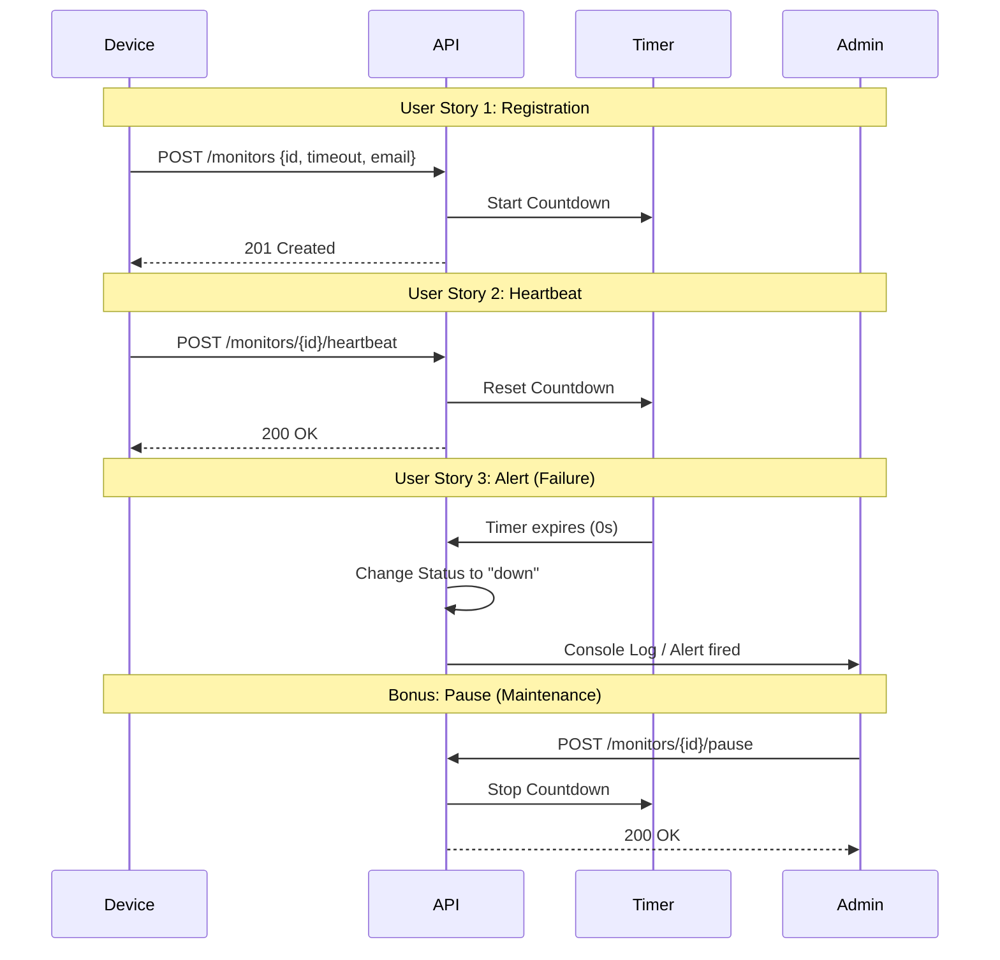

# Pulse-Check-API ("Watchdog" Sentinel)

A robust Dead Man's Switch API designed for CritMon Servers Inc. to monitor remote solar farms and weather stations. The system ensures critical infrastructure remains online by tracking periodic "I'm alive" heartbeats and triggering immediate alerts upon failure.

## 🏗️ Architecture

The system operates as a stateful sentinel. Each registered device maintains an independent countdown timer.

### Logic Flow



### State Diagram

1.  **UP**: Device is communicating normally; timer is active.
2.  **DOWN**: Timer reached zero; alert triggered.
3.  **PAUSED**: Monitoring suspended for maintenance; timer stopped.

---

## 🚀 Setup Instructions

### Prerequisites
- Node.js (v14 or higher)
- npm

### Installation
1. Clone the repository:
   ```bash
   git clone <your-repo-link>
   cd pulse-check-api
   ```
2. Install dependencies:
   ```bash
   npm install
   ```

### Running the Server
- **Production Mode**: `npm start` (Starts server on port 5000)
- **Development Mode**: `npm run dev` (Starts server with nodemon)

---

## 📖 API Documentation

### 1. Register a Monitor
Creates a new watchdog timer for a specific device.
- **Endpoint**: `POST /monitors`
- **Body**:
  ```json
  {
    "id": "solar-panel-01",
    "timeout": 60,
    "alert_email": "admin@critmon.com"
  }
  ```
- **Response**: `201 Created`

### 2. Send Heartbeat
Resets the countdown timer. If the monitor was paused, this action un-pauses it.
- **Endpoint**: `POST /monitors/:id/heartbeat`
- **Response**: `200 OK`

### 3. Pause Monitor
Stops the countdown timer for maintenance.
- **Endpoint**: `POST /monitors/:id/pause`
- **Response**: `200 OK`

### 4. List All Monitors
Retrieves the current status and event history of all monitors.
- **Endpoint**: `GET /monitors`
- **Response**: `200 OK`

---

## 🌟 Developer's Choice: Event History Logging

### Feature Overview
To enhance observability and traceability, I implemented **Event History Logging**. Every monitor maintains a persistent timeline of its lifecycle events.

### Why this was added?
In critical infrastructure monitoring, knowing *that* a device is down is only half the battle. Engineers need to know *when* the last heartbeat was received, *how often* it pings, and *who* paused the monitoring. 

This feature provides:
- **Audit Trail**: Track when maintenance (pausing) started and ended.
- **Debugging**: Easily identify patterns in connectivity failures.
- **Observability**: A single endpoint provides a complete narrative of the device's health over time.

### Implementation Detail
Each monitor object includes a `history` array that records:
- `CREATED`: Initial registration.
- `HEARTBEAT`: Successful reset of the timer.
- `PAUSED`: Manual suspension of monitoring.
- `ALERT`: Failure state triggered by timeout.

Example Output:
```json
{
  "id": "device-123",
  "status": "down",
  "history": [
    { "type": "CREATED", "time": "2026-06-12T10:00:00Z" },
    { "type": "HEARTBEAT", "time": "2026-06-12T10:01:00Z" },
    { "type": "ALERT", "time": "2026-06-12T10:02:00Z" }
  ]
}
```


